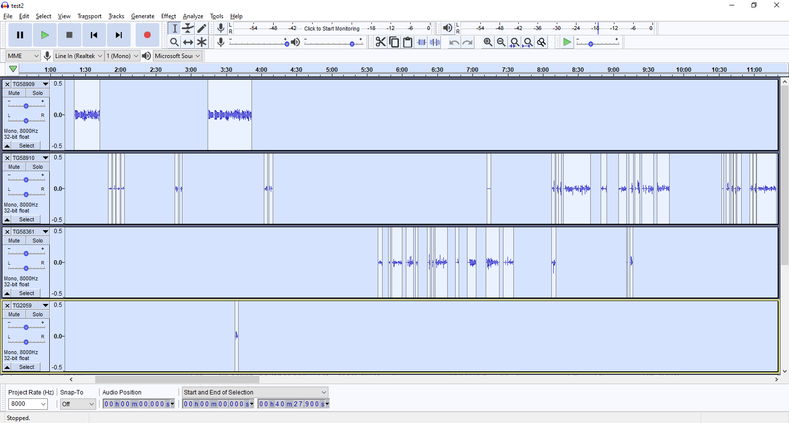
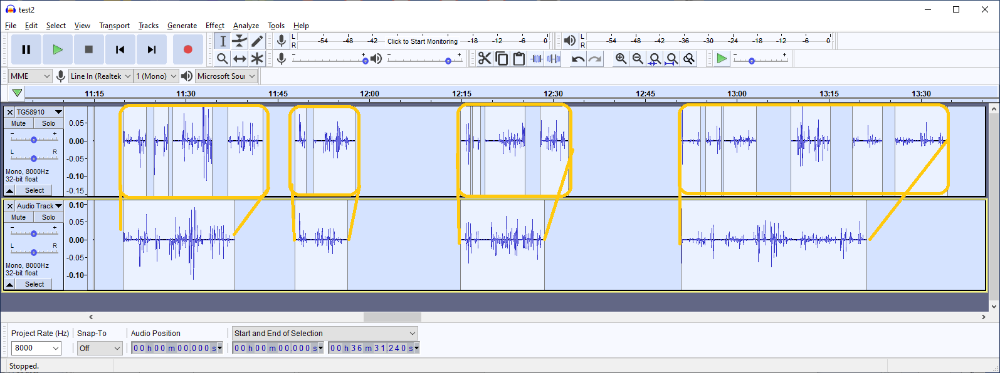

# incident_builder
Create a multi track [Audacity](https://www.audacityteam.org) project file from [trunk-recorder](https://github.com/robotastic/trunk-recorder) recordings.

Specify the date, time range, and talkgroup IDs to retrieve from your trunk-recorder recordings and incident_builder will create an Audacity project file and data folder with a separate audio track for each talkgroup ID, with transmission audio spaced in the track according to the recording timestamps.  

incident_builder is helpful for post-incident analysis of radio traffic for training and debriefing purposes.  

## Prerequisites
You must have [Python](https://python.org) installed on your system.  
## Usage
`builder.py Path Date StartTime StopTime TGIDS OutFile --splitwav`
### Required Positional Arguments
* **Path**      - Path to the base trunk-recorder audio recording directory for the system in question
* **Date**      - Date of the recordings to retrieve in MM/DD/YYYY format
* **StartTime** - Start time of the recordings to retrieve in HH:MM:SS format
* **StopTime**  - End time of the recordings to retrieve in HH:MM:SS format
* **TGIDS**     - Comma separated list of decimal format talkgroup IDs to retreive
* **OutFile**   - Filename of the output Audacity project file.  Must end with .aup extension

### Optional Arguments
* **--splitwav**    - When set, split WAV files into multiple segments in the Audacity track based on the logged JSON data. Results in more accurate timing of reconstructed audio.  Default is set.
* **--no-splitwav** - When set, a single segment is created in Audacity per WAV file.  Default is to use --splitwav

### Example:

`builder.py sample_data/oasiswauk 1/28/2020 07:42:00 08:30:00 58909,58910,58361,2059 output.aup --splitwav`
## Operation
Upon execution incident_builder will locate all of the recorded audio files for the specified date, time range, and talkgroups, convert the the WAV files to Audacity's .au sound file format (splitting them if specified), and create an Audacity project file (.aup extension - XML format) that arranges the individual files into tracks and locations for display in Audacity.

### --splitwav option
The image below shows the difference in how the Audacity project is created depending on whether the --splitwav option is used.  The top track was created with the --splitwav option, while the bottom track was created from the same recordings but with the --no-splitwav option.  The --splitwav option splits a single trunk-recorder .wav file into multiple audio segments (one for each radio transmission) and arranges them in time based on when the transmissions actually occured (trunk-recorder removes dead air from its wav file recordings).

## Known Issues
* Incidents that span more than one date (across midnight) are currently not supported.  Workaround is to create a different Audacity project file for the portion of the incident on each of the two days.  
 
